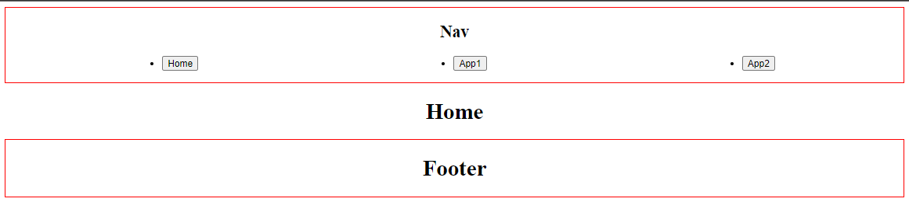

# Micro front end

## Biblioteca 📚

- Single spa [https://single-spa.js.org/](https://single-spa.js.org/)

## Esta aplicação contém 4 micro frontends

- Root → É responsavel por agrupar e orquestrar as aplicações
- Nav
- App1
- App2
- Footer

## Executar 🔥

É necessario instalar as dependencias em cada um dos projetos

```
yarn
```

Para executar a aplicação é necessario executar todos micro serviços

basta entrar nas respectivas pastas e executar

```
yarn start
```

## Se tudo deu certo 🙂

Basta entrar no [http://localhost:9000/](http://localhost:9000/), e você deve encontrar está tela



## Links de referência

Microfrontends na prática: [https://youtu.be/KZpSghOWOnE](https://youtu.be/KZpSghOWOnE)

**Single spa extension** (Para entender melhor o ciclo de vida dos micros front-ends): [https://chrome.google.com/webstore/detail/single-spa-inspector/emldbibkihanfiaiaghebffnbahjcgcp](https://chrome.google.com/webstore/detail/single-spa-inspector/emldbibkihanfiaiaghebffnbahjcgcp)


